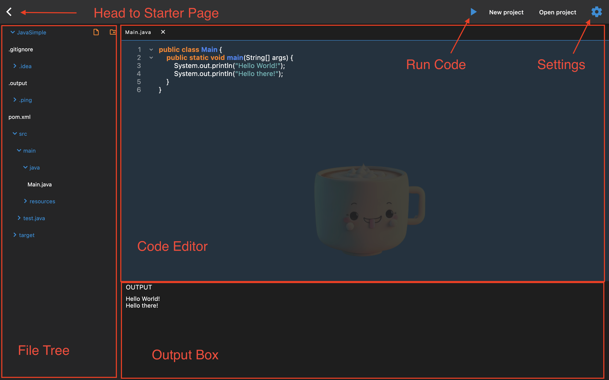
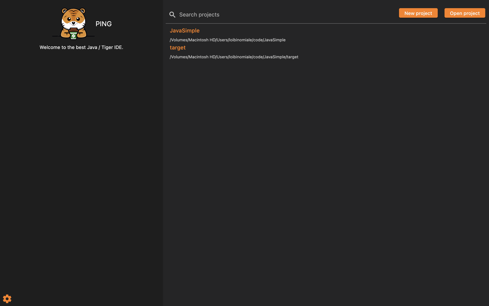
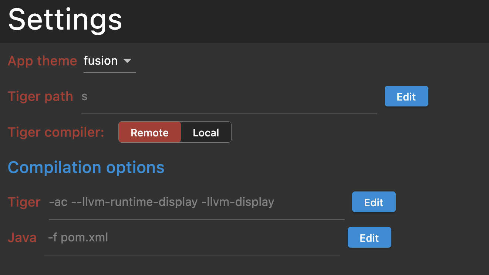

# Jaguar 🐯

Jaguar is an integrated development environment (IDE) designed specifically for Tiger and Java programming languages. It provides a comprehensive toolset to streamline your software development workflow and enhance your coding experience.







## Features

- **Syntax Highlighting**: Jaguar offers syntax highlighting to visually distinguish different elements of your code.

- **Code Completion**: Jaguar provides intelligent code completion that suggests language-specific constructs, methods, and variable names as you type. This feature saves you time and reduces typing errors.

- **Project Management**: Manage your projects efficiently with Jaguar's project management capabilities. Organize your files, view project structure, and easily switch between different projects.

- **Cool Themes**: In Jaguar, you have the choice between different themes. Tiger and Coffee lovers will be able to code in an environment that corresponds to them.

- **Full Control**: You can decide on the compiling options as well as whether you want to use our remote Tiger compiler or your own version of the Tiger compiler.

- **Easy to use**: The interface has been designed so anyone can get started and use the full potential of Jaguar very easily.

- **And more!**: Cool sounds are played when you execute, and more features are to come!

## Getting Started

### Building Jaguar

To get started with Jaguar, follow these steps:

1. Ensure you have **Flutter** installed on your machine. If you haven't, refer to the Flutter documentation for installation instructions: https://flutter.dev/docs/get-started/install

2. Clone this repository to your local machine.

3. Open a terminal or command prompt and navigate to the project directory.

4. Run the following command to fetch the project dependencies:
   ```bash
   flutter pub get
   ```

5. Connect a device (physical or virtual) to your machine.

6. Run the following command to launch Jaguar on the connected device:
   ```bash
   flutter run
   ```

### Installing Jaguar

Please refer to the User Guide in `docs/`.

## Documentation

The documentation for Jaguar can be found in the `docs/` directory of this repository. It includes:

- Project specifications
- User guide

Please refer to the appropriate documentation section for guidance on using and exploring the features of Jaguar.

Happy coding with Jaguar! 🐯👩‍💻👨‍💻
